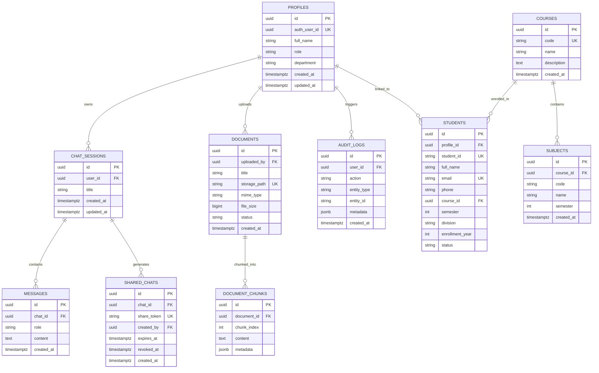

# College AI — Production Database Architecture & Technical Reference

This document serves as the canonical technical specification for the **College AI** PostgreSQL database layer on **Supabase**.

---

## 1. Architecture Overview

College AI utilizes a production-grade relational database architecture hosted on Supabase PostgreSQL (v15+), using Supabase Auth for credential handling and Supabase Storage for unstructured document binaries. The schema is designed with foreign key constraints, Row Level Security (RLS), composite indexes, and strict student privacy boundaries.



---

## 2. Core Entities & Schema Reference

### 2.1 `profiles`
Stores application-level profile details. Credentials, passwords, and multi-factor auth are delegated exclusively to `auth.users`.
* **`id`** (`UUID`, Primary Key, `DEFAULT gen_random_uuid()`): Unique application profile identifier.
* **`auth_user_id`** (`UUID`, Unique, Not Null): References Supabase `auth.users(id)`.
* **`full_name`** (`VARCHAR(255)`, Not Null): Legal or displayed user name.
* **`avatar_url`** (`TEXT`, Nullable): CDN URL or storage path to avatar picture.
* **`role`** (`VARCHAR(50)`, Not Null, Default `'student'`): Role hierarchy constraint (`CHECK (role IN ('student', 'teacher', 'admin'))`).
* **`department`** (`VARCHAR(150)`, Default `'General'`): Department affiliation.
* **`created_at`** (`TIMESTAMPTZ`, Default `CURRENT_TIMESTAMP`): Record creation timestamp.
* **`updated_at`** (`TIMESTAMPTZ`, Default `CURRENT_TIMESTAMP`): Maintained by trigger.

### 2.2 `courses`
Represents official degree programs offered by the institution.
* **`id`** (`UUID`, Primary Key, `DEFAULT gen_random_uuid()`)
* **`name`** (`VARCHAR(255)`, Not Null): Degree title (e.g., `Bachelor of Computer Applications`).
* **`code`** (`VARCHAR(50)`, Unique, Not Null): Unique academic code (e.g., `BCA`, `B.Tech-CSE`).
* **`description`** (`TEXT`, Nullable): Program syllabus overview and prerequisites.
* **`created_at`**, **`updated_at`** (`TIMESTAMPTZ`).

### 2.3 `subjects`
Specific academic subjects taught within a degree program.
* **`id`** (`UUID`, Primary Key, `DEFAULT gen_random_uuid()`)
* **`course_id`** (`UUID`, Foreign Key `courses.id`, `ON DELETE RESTRICT`): Parent course.
* **`name`** (`VARCHAR(255)`, Not Null): Subject name (e.g., `Database Management Systems`).
* **`code`** (`VARCHAR(50)`, Not Null): Course-specific code (e.g., `BCA-302`).
* **`semester`** (`INTEGER`, Not Null): Semester sequence (`CHECK (semester >= 1 AND semester <= 12)`).
* **`description`** (`TEXT`, Nullable): Syllabus description and learning objectives.
* **Constraint**: `UNIQUE (course_id, code)` prevents duplicate subject entries in the same program.

### 2.4 `students`
College roster containing enrollment and demographic metrics.
* **`id`** (`UUID`, Primary Key, `DEFAULT gen_random_uuid()`)
* **`profile_id`** (`UUID`, Foreign Key `profiles.id`, `ON DELETE SET NULL`, Nullable): Optional link to user profile for logged-in students.
* **`student_id`** (`VARCHAR(50)`, Unique, Not Null): Official roll number (e.g., `CS-2022-042`).
* **`full_name`** (`VARCHAR(255)`, Not Null): Full student name.
* **`email`** (`VARCHAR(255)`, Unique, Not Null): Academic email address.
* **`phone`** (`VARCHAR(50)`, Nullable): Contact phone number (**Private Field**).
* **`course_id`** (`UUID`, Foreign Key `courses.id`, `ON DELETE RESTRICT`): Enrolled course.
* **`semester`** (`INTEGER`, Not Null, `CHECK (semester >= 1 AND semester <= 12)`).
* **`division`** (`VARCHAR(10)`, Default `'A'`): Class section or batch.
* **`enrollment_year`** (`INTEGER`, Not Null, `CHECK (enrollment_year >= 2000 AND enrollment_year <= 2100)`).
* **`status`** (`VARCHAR(50)`, Not Null, Default `'active'`): `CHECK (status IN ('active', 'inactive', 'graduated', 'suspended'))`.
* **`created_at`**, **`updated_at`** (`TIMESTAMPTZ`).

### 2.5 `chat_sessions`
Conversational chat threads initiated by authenticated students, teachers, or administrators.
* **`id`** (`UUID`, Primary Key, `DEFAULT gen_random_uuid()`)
* **`user_id`** (`UUID`, Foreign Key `profiles.id`, `ON DELETE CASCADE`): Conversation author.
* **`title`** (`VARCHAR(255)`, Default `'New Conversation'`): Thread title.
* **`created_at`**, **`updated_at`** (`TIMESTAMPTZ`).

### 2.6 `messages`
Individual messages within a conversational thread.
* **`id`** (`UUID`, Primary Key, `DEFAULT gen_random_uuid()`)
* **`chat_id`** (`UUID`, Foreign Key `chat_sessions.id`, `ON DELETE CASCADE`): Parent thread.
* **`role`** (`VARCHAR(50)`, Not Null): `CHECK (role IN ('user', 'assistant', 'system'))`.
* **`content`** (`TEXT`, Not Null): Message text content.
* **`created_at`**, **`updated_at`** (`TIMESTAMPTZ`).

### 2.7 `shared_chats`
Cryptographically secure public read-only shares of conversation threads.
* **`id`** (`UUID`, Primary Key, `DEFAULT gen_random_uuid()`)
* **`chat_id`** (`UUID`, Foreign Key `chat_sessions.id`, `ON DELETE CASCADE`): Target thread.
* **`share_token`** (`VARCHAR(128)`, Unique, Not Null): High-entropy share token (e.g. `s-xyz123...`).
* **`created_by`** (`UUID`, Foreign Key `profiles.id`, `ON DELETE CASCADE`): User generating link.
* **`expires_at`** (`TIMESTAMPTZ`, Nullable): Optional expiration deadline.
* **`revoked_at`** (`TIMESTAMPTZ`, Nullable): Explicit revocation timestamp (NULL if active).
* **`created_at`** (`TIMESTAMPTZ`).

### 2.8 `documents`
Metadata records tracking institutional PDFs, regulations, and circulars stored in Supabase Storage.
* **`id`** (`UUID`, Primary Key, `DEFAULT gen_random_uuid()`)
* **`uploaded_by`** (`UUID`, Foreign Key `profiles.id`, `ON DELETE RESTRICT`): Authorizing staff profile.
* **`title`** (`VARCHAR(255)`, Not Null): Document title (e.g., `Academic Handbook 2026`).
* **`description`** (`TEXT`, Nullable): Summary description.
* **`file_name`** (`VARCHAR(255)`, Not Null): Original filename.
* **`storage_path`** (`VARCHAR(500)`, Unique, Not Null): Object path inside `college-documents` bucket.
* **`mime_type`** (`VARCHAR(100)`, Not Null): Validated MIME type (`application/pdf`, etc.).
* **`file_size`** (`BIGINT`, Not Null, `CHECK (file_size > 0)`): File size in bytes (max 25 MB).
* **`status`** (`VARCHAR(50)`, Default `'uploaded'`): `CHECK (status IN ('uploaded', 'processing', 'processed', 'failed', 'archived'))`.
* **`created_at`**, **`updated_at`** (`TIMESTAMPTZ`).

### 2.9 `document_chunks`
Text segments extracted from institutional documents, ready for RAG embeddings.
* **`id`** (`UUID`, Primary Key, `DEFAULT gen_random_uuid()`)
* **`document_id`** (`UUID`, Foreign Key `documents.id`, `ON DELETE CASCADE`): Source document.
* **`chunk_index`** (`INTEGER`, Not Null, `CHECK (chunk_index >= 0)`): Sequence index of chunk.
* **`content`** (`TEXT`, Not Null): Plaintext chunk content.
* **`metadata`** (`JSONB`, Default `'{}'::jsonb`): Chunk page numbers, headings, section titles.
* **Constraint**: `UNIQUE (document_id, chunk_index)` prevents duplicate indexing.
* **`created_at`**, **`updated_at`** (`TIMESTAMPTZ`).

### 2.10 `audit_logs`
Append-only log of security and administrative operations.
* **`id`** (`UUID`, Primary Key, `DEFAULT gen_random_uuid()`)
* **`user_id`** (`UUID`, Foreign Key `profiles.id`, `ON DELETE SET NULL`, Nullable): Actor profile.
* **`action`** (`VARCHAR(100)`, Not Null): Event type (`student_created`, `document_uploaded`, `chat_shared`).
* **`entity_type`** (`VARCHAR(100)`, Not Null): Target domain (`student`, `document`, `chat_session`).
* **`entity_id`** (`VARCHAR(100)`, Nullable): Primary key of the modified record.
* **`metadata`** (`JSONB`, Default `'{}'::jsonb`): Event context. **Secrets, passwords, and tokens are never logged.**
* **`created_at`** (`TIMESTAMPTZ`, Default `CURRENT_TIMESTAMP`).

---

## 3. Relationships & Foreign Key Deletion Semantics

| Parent Table | Child Table | Foreign Key | On Delete Action | Rationale |
| :--- | :--- | :--- | :--- | :--- |
| `profiles` | `students` | `students.profile_id` | **`SET NULL`** | Deleting a user account must not erase legal student academic records. |
| `courses` | `subjects` | `subjects.course_id` | **`RESTRICT`** | A course with active curriculum subjects cannot be accidentally dropped. |
| `courses` | `students` | `students.course_id` | **`RESTRICT`** | A course cannot be deleted while enrolled students are assigned to it. |
| `profiles` | `chat_sessions` | `chat_sessions.user_id` | **`CASCADE`** | Chat sessions belong to the user; account deletion cleans up user chats. |
| `chat_sessions`| `messages` | `messages.chat_id` | **`CASCADE`** | Messages are thread-scoped; deleting a conversation deletes its messages. |
| `chat_sessions`| `shared_chats` | `shared_chats.chat_id` | **`CASCADE`** | Deleting a chat invalidates any public share token. |
| `profiles` | `documents` | `documents.uploaded_by` | **`RESTRICT`** | Documents uploaded by staff remain archived even if the staff member departs. |
| `documents` | `document_chunks` | `document_chunks.document_id`| **`CASCADE`** | Document chunks are derived data; deleting the source document deletes chunks. |
| `profiles` | `audit_logs` | `audit_logs.user_id` | **`SET NULL`** | Audit logs are immutable records and must never be deleted. |

---

## 4. Indexing Strategy

* `profiles(auth_user_id)`: Instant O(1) user profile lookup on incoming JWT authentication headers.
* `profiles(role)`: Rapid role-based authorization filtering.
* `courses(code)`: Fast course curriculum resolution by code.
* `subjects(course_id, semester)`: Composite index optimized for "Get semester curriculum" queries.
* `students(student_id)`: Unique index for fast roll number lookups.
* `students(course_id, semester)`: Composite index for batch student lists and departmental queries.
* `students(full_name)`: Trigram/B-Tree index for directory searches.
* `chat_sessions(user_id, updated_at DESC)`: Primary query pattern for loading user's conversation sidebar list.
* `messages(chat_id, created_at ASC)`: Primary query pattern for chronological message loading.
* `shared_chats(share_token)`: Instant lookup of public shared conversations.
* `documents(status, created_at DESC)`: Filter by processing status for document indexing pipelines.
* `document_chunks(document_id, chunk_index)`: Ordered retrieval of text chunks during RAG context assembly.
* `document_chunks USING gin (metadata)`: JSONB index for structured document chunk filtering.
* `audit_logs(user_id, created_at DESC)`: Rapid audit trail review by administrator.

---

## 5. Row Level Security (RLS) Policies

All sensitive tables have Row Level Security enabled (`ALTER TABLE ... ENABLE ROW LEVEL SECURITY`):

1. **`profiles`**:
   - `SELECT`: User can view their own profile; teachers & admins can view student profiles.
   - `UPDATE`: User can update non-role profile attributes (`full_name`, `avatar_url`); only admins can modify roles.
2. **`courses` & `subjects`**:
   - `SELECT`: All authenticated users (`student`, `teacher`, `admin`) can view academic courses.
   - `INSERT/UPDATE/DELETE`: Restricted exclusively to `admin`.
3. **`students` (Strict Privacy Rule)**:
   - `SELECT`: Teachers & Admins can access all records. Students can **only** read their own linked record (`profile_id = current_profile_id()`).
   - `INSERT/DELETE`: Restricted to `admin`.
   - `UPDATE`: Restricted to `teacher` and `admin`.
4. **`chat_sessions`**:
   - `SELECT`, `INSERT`, `UPDATE`, `DELETE`: Strict ownership isolation (`user_id = current_profile_id()`). No cross-tenant access.
5. **`messages`**:
   - `SELECT`: Readable by the conversation owner, OR anonymously accessible if a valid, non-expired, non-revoked share token exists in `shared_chats`.
   - `INSERT`, `UPDATE`, `DELETE`: Restricted strictly to conversation owner.
6. **`shared_chats`**:
   - `SELECT`: Creator can view their links; public/anonymous users can read active (`revoked_at IS NULL AND (expires_at IS NULL OR expires_at > now())`) links.
   - `INSERT`, `UPDATE`, `DELETE`: Only creator of the conversation can create or revoke.
7. **`documents` & `document_chunks`**:
   - `SELECT`: Authenticated users can view processed institutional documents.
   - `INSERT/UPDATE`: Restricted to `teacher` and `admin`.
   - `DELETE`: Restricted to `admin`.
8. **`audit_logs`**:
   - `SELECT`: Strictly restricted to `admin`.
   - `INSERT`: System triggers and authenticated actions.
   - `UPDATE`/`DELETE`: Disallowed permanently (immutable audit log).

---

## 6. Student Privacy Architecture

* **Field-level separation**:
  - **Public Directory Data**: `student_id`, `full_name`, `course`, `semester`, `division`, `status`.
  - **Sensitive Private Data**: `phone`, `email`, `profile_id`.
* The FastAPI backend and RLS policies guarantee that general directory search responses do **NOT** return phone numbers or private email addresses to unprivileged users.
* Shared chat views never expose student contact details or internal user IDs.

---

## 7. Supabase Storage Setup (`college-documents`)

* **Bucket Name**: `college-documents`
* **Visibility**: **Private** (Not public; accessed via signed URLs or backend streaming).
* **Allowed MIME Types**: `application/pdf`, `application/msword`, `application/vnd.openxmlformats-officedocument.wordprocessingml.document`, `text/plain`, `text/markdown`.
* **Max File Size**: 25 MB (`26214400` bytes).
* **Storage Policies**:
  - `SELECT`: Authenticated college members can download documents.
  - `INSERT`: Only authenticated Faculty (`teacher`) and Admins can upload files.
  - `DELETE`: Only Admins can remove files from the storage bucket.

---

## 8. Future AI / RAG Extension Points

The schema is built to accommodate future LLM and Vector Search integration without requiring structural migrations:

1. **`pgvector` Extension**:
   ```sql
   CREATE EXTENSION IF NOT EXISTS vector;
   ALTER TABLE document_chunks ADD COLUMN embedding vector(1536);
   CREATE INDEX idx_chunks_embedding ON document_chunks USING ivfflat (embedding vector_cosine_ops);
   ```
2. **Chunk Ingestion Flow**:
   When a document PDF is uploaded to Supabase Storage:
   - Worker triggers text extraction and chunking.
   - Chunks are inserted into `document_chunks` with `chunk_index` and metadata (page number, section).
   - In the AI phase, embeddings (e.g., text-embedding-3-small or Gemini text-embedding-004) are written directly into `document_chunks.embedding`.
3. **Retrieval**:
   FastAPI queries `document_chunks` via cosine similarity (`<=>`), fetches relevant context passages, and supplies them to the prompt pipeline.

---

## 9. Migration & Setup Instructions

### 9.1 Fresh Supabase Setup
1. Log into your Supabase Dashboard at [supabase.com](https://supabase.com).
2. Open the **SQL Editor**.
3. Execute the migration scripts in order:
   - `database/migrations/001_initial_schema.sql`: Core tables, indexes, constraints, triggers.
   - `database/migrations/002_row_level_security.sql`: Helper functions and RLS security policies.
   - `database/migrations/003_storage_setup.sql`: Storage bucket configuration and object policies.
4. *(Optional Development)* Execute the seed script:
   - `database/seed/seed.sql`: Realistic demo courses, subjects, demo students, and sample documents.

### 9.2 Running Locally with FastAPI
In `backend/.env`:
```env
DATABASE_URL=sqlite:///./college_ai.db
```
The FastAPI backend auto-initializes all tables on startup via SQLAlchemy declarative metadata and runs isolated in-memory tests with `pytest`.
